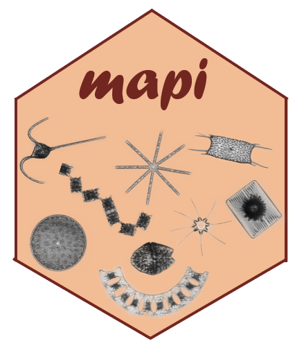

<!-- README.md is generated from README.Rmd. -->

#  Morphological Analysis of (Phyto)Plankton Imagery

<!-- badges: start -->

<!-- badges: end -->

This project contains the analysis and graphs used in the article *Size,
width, shape regularity, and chains: time series analysis of
phytoplankton morphology from imagery in Narragansett Bay* by Sonnet et
al. (2022, in revision).
